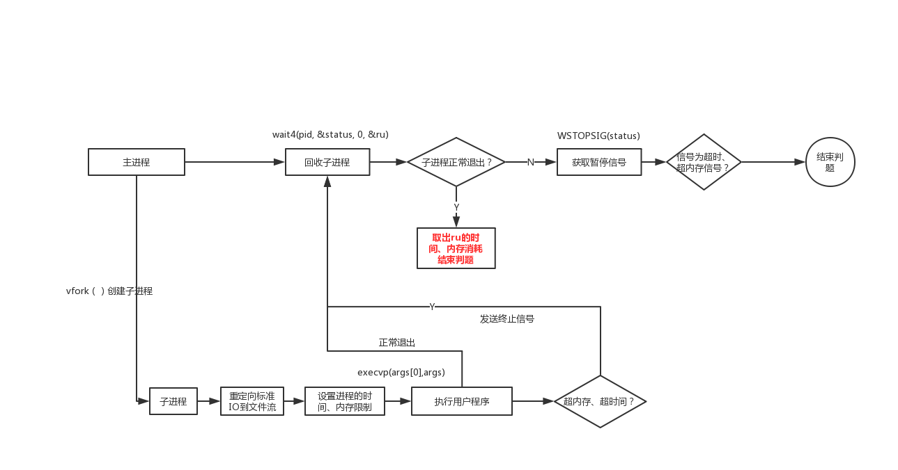

# judge-runner
judge-runner
## 获取可执行程序的时间、空间消耗
详细： https://blog.csdn.net/qq_38089964/article/details/86030149

核心命令：
* vfork();创建子进程
* ptrace(PTRACE_TRACEME, 0, NULL, NULL);与子进程建立跟踪
* setrlimit(RLIMIT_CPU, &rl);设置子进程的时间、内存限制
* execvp(args[0],args);运行可执行程序
* wait4(pid, &status, WUNTRACED, &ru);暂停子进程，获取子进程的信息
* ptrace(PTRACE_CONT, pid, NULL, NULL);唤醒子进程
* ptrace(PTRACE_KILL, pid, NULL, NULL);杀死子进程
